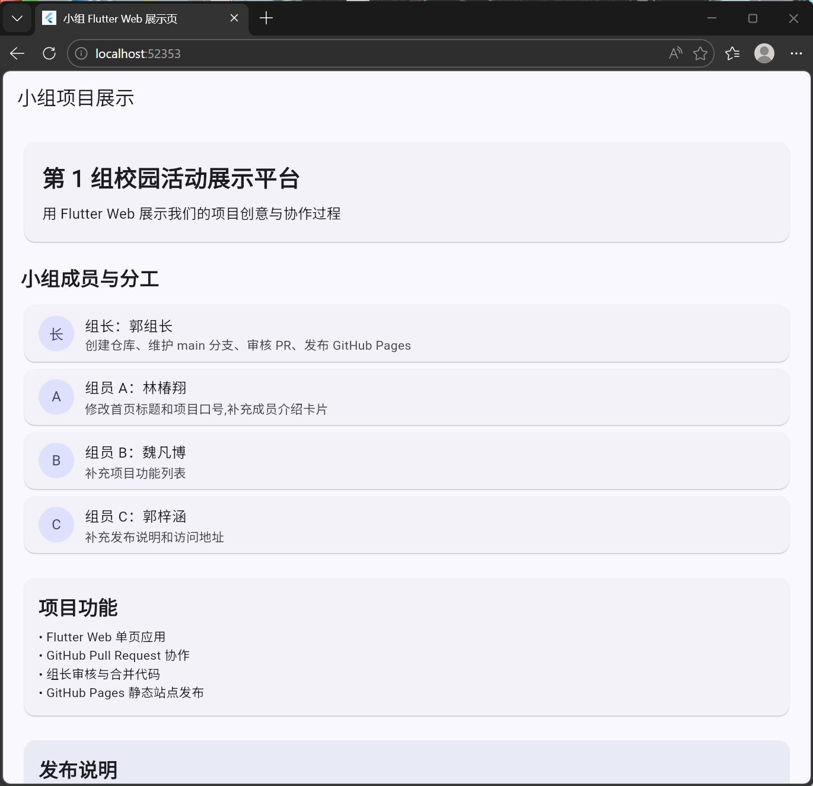
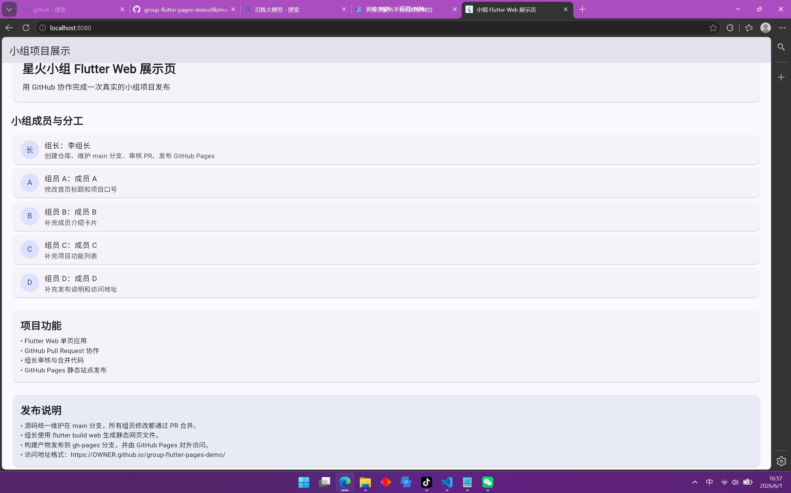

# 小组 Flutter Web 展示页示例项目

这是配套"GitHub 协作与 Flutter Web 部署"案例的初始项目。组长可以把这个项目提交到 GitHub 仓库的 main 分支，4 名组员分别基于它提交 Pull Request。

## 本地运行

```bash
flutter pub get
flutter run
```

如果要用浏览器运行，可以选择 Chrome 或 web-server：

```bash
flutter run -d web-server
```

## 构建 Web 静态文件

把 REPO_NAME 替换成你的 GitHub 仓库名：

```bash
flutter build web --base-href group-flutter-pages-demo
```

构建完成后，静态网站文件位于：

```text
build/web/
```

这些文件可以发布到仓库的 gh-pages 分支。

## 组员任务入口

4 名组员可以分别修改 lib/main.dart 中的不同位置：

1. 组员 A：修改 projectTitle 和 projectSlogan。members，补充真实姓名和分工。
2. 组员 B：修改 features ，补充项目功能。
3. 组员 C：修改 releaseNotes ，补充部署说明和访问地址。

每名组员都应该在自己的分支上修改，提交 commit，然后向组长发起 Pull Request。

## 组员任务效果

### 组员 A：修改首页标题、项目口号和成员介绍

**任务**：修改 `projectTitle`、`projectSlogan` 和 `members` 列表，补充真实姓名和分工。

修改位置在 `lib/main.dart` 中：

```dart
static const String projectTitle = '第 1 组校园活动展示平台';
static const String projectSlogan = '用 Flutter Web 展示我们的项目创意与协作过程';

static const List<TeamMember> members = [
  TeamMember(role: '组长', name: '郭组长', task: '创建仓库、维护 main 分支、审核 PR、发布 GitHub Pages'),
  TeamMember(role: '组员 A', name: '林椿翔', task: '修改首页标题和项目口号,补充成员介绍卡片'),
  TeamMember(role: '组员 B', name: '魏凡博', task: '补充项目功能列表'),
  TeamMember(role: '组员 C', name: '郭梓涵', task: '补充发布说明和访问地址'),
];
```

修改后的页面效果：



> 图中顶部大标题和口号已替换为小组真实信息，下方成员卡片显示了每位组员的真实姓名和具体分工。

### 组员 C：修改发布说明和访问地址

**任务**：修改 `releaseNotes` 列表，将占位的部署说明替换为实际的项目发布地址。

修改后的页面效果：



> 图中底部淡蓝色卡片即为发布说明区域，显示了 GitHub Pages 的访问地址。
